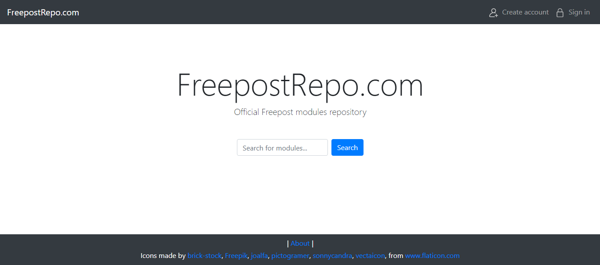

# FreepostRepo

FreepostRepo - это веб-платформа для централизованного распространения программных расширений клиент-серверного приложения Freepost. Разработана с учётом шаблонов разработки MVC, Front Controller и Dependency Injection.



## Характеристики веб-платформы

- **Централизованное хранилище**: Управление и хранение всех расширений в одном месте.
- **Функции поиска и фильтрации**: Лёгкий доступ к нужным расширениям.
- **Функции регистрации и авторизации**: Поддержка создания и управления учетными записями пользователей.
- **Административный раздел**: Расширенные функции для администрирования платформы.

## Стек технологий

- **Backend**: PHP 8.2, Composer, MySQL, PDO
- **Frontend**: HTML, CSS, JavaScript, Bootstrap

## В планах

- Перенос проекта на фреймворк Laravel
- Рефакторинг части кода, связанной с работой с файлами
- Переработка ролей доступа к модулям
- Добавление рейтинга модулей
- Функция отзывов к каждому модулю

## Инструкция по развёртке

1. Клонировать репозиторий в корневую папку веб-сервера:
    ```sh
    git clone https://github.com/MurdaWitness/FreepostRepo.git
    ```
2. Установить зависимости с помощью Composer:
    ```sh
    composer install
    ```
3. Создать базу данных в MySQL.
4. Для создания таблиц использовать SQL файлы из корня проекта.
5. Прописать в `config/database.php` данные для подключения к базе данных:
    ```php
	return [
    'driver' => 'your_database_driver',
    'host' => 'your_database_host',
    'port' => 'your_database_port',
    'database' => 'your_database_name',
    'username' => 'your_database_username',
    'password' => 'your_database_password',
    'charset' => 'your_database_charset',
	];
    ```
6. Для выдачи роли "администратор" нужно создать пользователя и вручную в таблице с пользователями поменять его роль на `admin`.